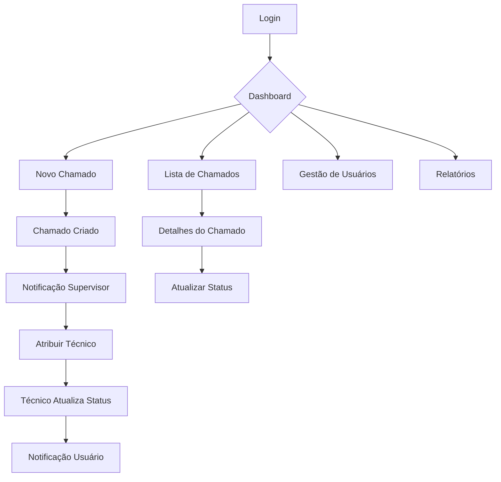

## 1. Visão Geral do Produto

Sistema de gestão de chamados simplificado para empresas de pequeno/médio porte. Permite que funcionários abram solicitações de suporte e acompanhem seu progresso de forma organizada e eficiente.

- Resolve o problema de controle manual de solicitações de suporte
- Destinado a empresas com até 30 funcionários
- Fornece visibilidade e organização do fluxo de atendimento
- Valor de mercado: solução econômica e prática para gestão de suporte interno

## 2. Funcionalidades Principais

### 2.1 Papéis de Usuário

| Papel | Método de Registro | Permissões Principais |
|------|---------------------|------------------|
| Usuário Comum | Cadastro pelo administrador | Abrir chamados, visualizar próprios chamados, atualizar status |
| Técnico/Suporte | Cadastro pelo administrador | Atender chamados atribuídos, atualizar status, adicionar comentários |
| Supervisor/Admin | Cadastro inicial | Gerenciar usuários, atribuir chamados, visualizar relatórios, configurar sistema |

### 2.2 Módulos de Funcionalidades

O sistema de chamados consiste nas seguintes páginas principais:

1. **Página de Login**: autenticação de usuários, recuperação de senha
2. **Dashboard Principal**: visão geral dos chamados, estatísticas rápidas
3. **Página de Novo Chamado**: formulário de criação com campos essenciais
4. **Lista de Chamados**: visualização com filtros e busca
5. **Detalhes do Chamado**: visualização completa e atualização de status
6. **Gestão de Usuários**: cadastro e edição de usuários (admin)
7. **Relatórios**: métricas mensais de chamados

### 2.3 Detalhamento das Páginas

| Nome da Página | Módulo | Descrição das Funcionalidades |
|-----------|-------------|---------------------|
| Login | Formulário de Login | Autenticar usuário com email e senha, link para recuperação de senha |
| Dashboard | Visão Geral | Exibir total de chamados por status, chamados recentes, atalhos rápidos |
| Dashboard | Estatísticas | Gráfico simples com chamados dos últimos 30 dias |
| Novo Chamado | Formulário | Campos: título, descrição, categoria (Hardware/Software/Rede/Outros), prioridade (Baixa/Média/Alta/Urgente) |
| Novo Chamado | Validação | Validar campos obrigatórios, confirmar envio, limpar formulário após sucesso |
| Lista de Chamados | Tabela de Chamados | Exibir ID, título, solicitante, status, prioridade, data de criação, técnico atribuído |
| Lista de Chamados | Filtros | Filtrar por status, categoria, prioridade, data, solicitante |
| Lista de Chamados | Ações | Botões para visualizar detalhes, editar (se permitido) |
| Detalhes do Chamado | Informações | Mostrar todos os dados do chamado, histórico de alterações |
| Detalhes do Chamado | Atualização | Permitir mudança de status, adicionar comentários, atribuir técnico |
| Gestão de Usuários | Lista | Visualizar todos os usuários com busca e filtros por departamento |
| Gestão de Usuários | Cadastro | Formulário com nome, email, departamento, tipo de usuário, senha inicial |
| Relatórios | Métricas | Total de chamados no mês, taxa de resolução, tempo médio de resolução |
| Relatórios | Gráficos | Gráfico de pizza por categoria, gráfico de barras por status |

## 3. Fluxo Principal do Processo

### Fluxo do Usuário Comum
1. Usuário faz login no sistema
2. Acessa dashboard e vê seus chamados ativos
3. Clica em "Novo Chamado" para abrir solicitação
4. Preenche formulário com título, descrição, categoria e prioridade
5. Sistema gera ID automático e confirma criação
6. Usuário pode acompanhar status na lista de chamados
7. Recebe notificação quando chamado for resolvido

### Fluxo do Supervisor
1. Supervisor faz login e vê dashboard com todos os chamados
2. Recebe notificação de novo chamado por email
3. Acessa detalhes do chamado
4. Atribui chamado a técnico disponível
5. Acompanha progresso através dos status atualizados
6. Visualiza relatórios mensais para análise

### Fluxo do Técnico
1. Técnico faz login e vê chamados atribuídos
2. Acessa detalhes do chamado para entender solicitação
3. Atualiza status para "Em Andamento" ao iniciar atendimento
4. Adiciona comentários sobre o progresso
5. Marca como "Resolvido" ao concluir
6. Usuário solicitante recebe notificação de conclusão

## 4. Design da Interface do Usuário

### 4.1 Estilo de Design

- **Cores Primárias**: Azul corporativo (#2563EB) para elementos principais
- **Cores Secundárias**: Cinza claro (#F3F4F6) para fundos, Verde (#10B981) para status resolvido, Vermelho (#EF4444) para urgente
- **Botões**: Estilo arredondado com sombra sutil, hover com transição suave
- **Tipografia**: Fonte sans-serif moderna (Inter ou similar), títulos 18-24px, corpo 14-16px
- **Layout**: Cards com bordas arredondadas, navegação lateral ou superior limpa
- **Ícones**: Estilo outline minimalista, consistente em todo sistema

### 4.2 Visão Geral das Páginas

| Página | Módulo | Elementos de UI |
|-----------|-------------|-------------|
| Login | Formulário | Card centralizado com logo, campos de entrada com ícones, botão primário destacado |
| Dashboard | Cards | Cards com números destacados, gráfico de barras simples, tabela compacta de chamados recentes |
| Novo Chamado | Formulário | Layout em coluna única, campos com labels acima, dropdowns estilizados, botão de submit verde |
| Lista de Chamados | Tabela | Tabela zebra com hover, badges coloridos para status, ícones de ação, barra de filtros acima |
| Detalhes | Layout | Card principal com informações, seção de histórico em timeline, botões de ação alinhados |
| Gestão | Tabela/Form | Tabela de usuários com busca, modal para cadastro, formulário em duas colunas |
| Relatórios | Gráficos | Cards com métricas, gráficos interativos simples, botão de exportar PDF |

### 4.3 Responsividade

- **Desktop-First**: Otimizado para telas grandes (1366px+), aproveitando espaço horizontal
- **Mobile-Adaptive**: Layout adaptativo para tablets (768px) e smartphones (375px)
- **Touch-Friendly**: Botões com área de toque mínima 44x44px, espaçamento adequado
- **Breakpoints**: Desktop (>1024px), Tablet (768-1024px), Mobile (<768px)